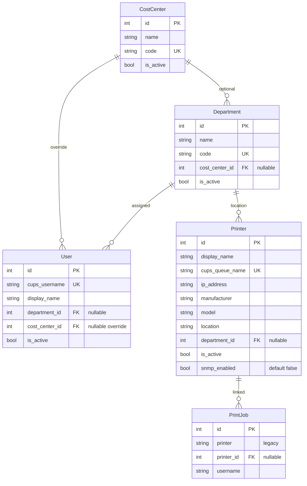

# Phase 5 Context — Master Data & Organization

**Milestone:** v1.5 Management Platform  
**Phase:** 5 — Master Data & Organization  
**Status:** Architectural discussion (pre-planning)  
**Created:** 2026-05-27

---

## Phase Goal

Estabelecer o modelo de domínio operacional (impressoras, departamentos, centros de custo, usuários) e vincular jobs a impressoras cadastradas — **sem modificar o hot path de captura**.

**Requirements:** 28 REQ — ver `REQUIREMENTS.md` seção "Phase 5 — Detailed Requirements"

---

## Constraints (non-negotiable)

| # | Constraint | Source |
|---|------------|--------|
| C1 | Watcher não importa modelos de org; INSERT não espera FK | Research PITFALLS #1 |
| C2 | `printer_id` nullable; preenchido async/batch | USER + ARCHITECTURE.md |
| C3 | SQLite + monólito + Docker Compose | PROJECT.md |
| C4 | CC ≠ Department (entidades distintas) | USER decision |
| C5 | Settings/analytics failure ≠ print failure | Core value v1.0 |
| C6 | Reuse `normalize_printer_name()` para matching | Fase 3 GAP-02-01 |

---

## Proposed Domain Model



### Linking rules

| Link | Strategy | When |
|------|----------|------|
| Job → Printer | `normalize(cups_queue) == normalize(printer.cups_queue_name)` | Matcher (batch + periodic) |
| Job → User | `job.username == user.cups_username` | Read-time join (soft) |
| User → CC | `user.cost_center_id` OR `department.cost_center_id` | Read-time (chargeback Fase 6) |

---

## Architecture Decisions to Discuss

### AD-01: Where does printer_id assignment run?

| Option | Pros | Cons |
|--------|------|------|
| **A. Background task in FastAPI lifespan** | Simple; no watcher change | Slight delay before ID appears |
| **B. SQL trigger on INSERT** | Immediate | Couples DB to registry; watcher still shouldn't wait |
| **C. Separate worker container** | Isolation | Overengineering for v1.5 |

**Recommendation:** A — periodic task (60s) + manual `POST /admin/backfill-printer-ids`

---

### AD-02: User ↔ Job relationship

| Option | Pros | Cons |
|--------|------|------|
| **A. Soft link by username string** | Matches v1.0 AS-IS; no migration of jobs | Rename user = orphan until update |
| **B. FK user_id on print_jobs** | Strong integrity | Requires backfill; username changes break |

**Recommendation:** A for Phase 5 (soft link); revisit if LDAP sync added

---

### AD-03: Settings UI structure

| Option | Pros | Cons |
|--------|------|------|
| **A. `/settings/*` routes, shared AppShell** | Clear separation | More routes |
| **B. Modal drawer over audit dashboard** | Less navigation | Cramped for CRUD tables |

**Recommendation:** A — `/settings/printers`, `/settings/departments`, etc.

---

### AD-04: Deprecate GET /printers (DISTINCT log)

| Option | Pros | Cons |
|--------|------|------|
| **A. Replace with registry; show "unmapped queues" endpoint** | Clean canonical model | FilterBar migration |
| **B. Keep both during transition** | Safer | Duplication |

**Recommendation:** B for Phase 5 — registry primary; log-distinct as `GET /printers/unmapped-queues` helper

---

### AD-05: Alembic placement

| Option | Pros | Cons |
|--------|------|------|
| **A. `backend/alembic/` standard layout** | Convention | New folder |
| **B. Raw SQL migration scripts** | No dep | Harder rollback |

**Recommendation:** A — Alembic from day one of Phase 5

---

### AD-06: CSV import transaction model

| Option | Pros | Cons |
|--------|------|------|
| **A. All-or-nothing per file** | Simple | One bad row fails all |
| **B. Row-level with partial commit** | USER wants IMPORT-04 | More complex UI |

**Recommendation:** B — default partial; option `?strict=true` for all-or-nothing

---

## Open Questions (for discussion)

1. **Printer matcher frequency:** 60s periodic enough, or trigger on Settings save only?
2. **Unique CUPS queue name:** enforce globally unique, or allow duplicate display names with unique queue?
3. **Department code / CC code:** required or optional? Case sensitivity?
4. **Deactivate vs delete:** soft-delete only (recommended) — confirm no hard delete in UI?
5. **Settings auth:** confirm no nginx basic auth in v1.5 (rely on network isolation)?
6. **Shared normalize module:** extract to `backend/app/core/normalize.py` imported by watcher AND API — acceptable coupling?

---

## Proposed Schema (draft SQL)

```sql
-- cost_centers
CREATE TABLE cost_centers (
  id INTEGER PRIMARY KEY,
  code VARCHAR(50) UNIQUE NOT NULL,
  name VARCHAR(255) NOT NULL,
  is_active BOOLEAN DEFAULT 1,
  created_at DATETIME NOT NULL,
  updated_at DATETIME NOT NULL
);

-- departments
CREATE TABLE departments (
  id INTEGER PRIMARY KEY,
  code VARCHAR(50) UNIQUE NOT NULL,
  name VARCHAR(255) NOT NULL,
  cost_center_id INTEGER REFERENCES cost_centers(id),
  is_active BOOLEAN DEFAULT 1,
  created_at DATETIME NOT NULL,
  updated_at DATETIME NOT NULL
);

-- users
CREATE TABLE users (
  id INTEGER PRIMARY KEY,
  cups_username VARCHAR(255) UNIQUE NOT NULL,
  display_name VARCHAR(255),
  department_id INTEGER REFERENCES departments(id),
  cost_center_id INTEGER REFERENCES cost_centers(id),
  is_active BOOLEAN DEFAULT 1,
  created_at DATETIME NOT NULL,
  updated_at DATETIME NOT NULL
);

-- printers
CREATE TABLE printers (
  id INTEGER PRIMARY KEY,
  display_name VARCHAR(255) NOT NULL,
  cups_queue_name VARCHAR(255) UNIQUE NOT NULL,
  ip_address VARCHAR(45),
  manufacturer VARCHAR(100),
  model VARCHAR(100),
  location VARCHAR(255),
  department_id INTEGER REFERENCES departments(id),
  snmp_enabled BOOLEAN DEFAULT 0,
  is_active BOOLEAN DEFAULT 1,
  created_at DATETIME NOT NULL,
  updated_at DATETIME NOT NULL
);

-- print_jobs alteration
ALTER TABLE print_jobs ADD COLUMN printer_id INTEGER REFERENCES printers(id);
CREATE INDEX ix_print_jobs_printer_id ON print_jobs(printer_id);
```

---

## Integration with Existing Code

| Existing | Phase 5 change |
|----------|----------------|
| `backend/app/db/models.py` | Add 4 models; alter PrintJob |
| `backend/app/api/v1/printers.py` | Evolve or split registry vs unmapped |
| `backend/app/services/normalize_printer_name` | Extract to shared module |
| `frontend/src/` | New `settings/` routes + nav item |
| `watcher` | Optional: import normalize only |

---

## Discussion Agenda

1. Confirm AD-01 through AD-06 recommendations (or override)
2. Resolve open questions 1–6
3. Validate schema draft vs requirements P5-AC-01–07
4. Agree plan breakdown strategy (schema → API → UI → matcher → backfill)
5. **Gate:** explicit "architecture approved" before `/gsd-plan-phase 5`

---

## References

- `.planning/REQUIREMENTS.md` — Phase 5 detailed
- `.planning/research/ARCHITECTURE.md`
- `.planning/research/PITFALLS.md`
- `backend/app/db/models.py` — current schema
- `.planning/phases/03-backend-api/03-02-PLAN.md` — normalize_printer_name

---

*Next: discuss decisions in chat or run `/gsd-discuss-phase 5` to formalize DISCUSSION-LOG.md*
